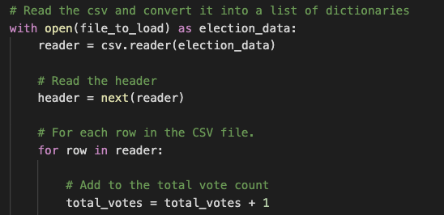
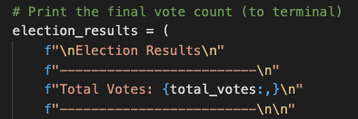

# **Election Audit Analysis**

## **1. Overview of Election Audit**

Tom, a Colorado Board of Elections employee has been tasked with the election audit of the tabulated results for a US congressional precinct in Colorado.  Though this can be easily done in Excel, Tom wants to automate this process with the hopes of using the code in other congressional and senatorial districts as well as in local elections.

We will be working with the following **resources** to generate the results:
- Data Source (results gathered from mail in ballots, punch cards and DRE counting machines): election_results.csv
- Software: Python 3.7.6, Visual Studio Code 1.47.3

## **2. Election Audit Results**
- Number of votes cast in this congressional election:
  - **Results:** 369,711 total votes were cast in the election.
  - **Details:**
    - We first wrote a script to initialize an accumulator to count up all the votes: total_votes = 0
    - We opened up the Data Source using the with open() statement and looped through all the rows to count up the total votes. 
      
    - Utilized the print statement to show the final vote count.
      
      
- Breakdown of the number of votes and the percentage of total votes for each county in the precinct:
  - **Results:** 
    - Jefferson: 38,855 total number of votes, 10.5% of the total votes
    - Denver: 306,055 total number of votes, 82.8% of the total votes
    - Arapahoe: 24,801 total number of votes, 6.7% of the total votes
  - **Details:**
  
- County with the largest number of votes:
  - **Results:** Denver
  - **Details:**
  
- Breakdown of the number of votes and the percentage of the total votes each candidate received:
  - **Results:**
    - Charles Casper Stockham: 85,213 total number of votes, 23.0% of the total votes
    - Diana DeGette: 272,892 total number of votes, 73.8% of the total votes
    - Raymon Anthony Doane: 11,606 number of votes, 3.1% of the total votes
  - **Details:**
  
- Winning candidate, their vote count, and their percentage of the total votes:
  - **Results:** Diana DeGette won with a total of 272,892 votes winning 73.8% of the total votes.
  - **Details:**

## **3. Election Audit Summary**

