# **Election Audit Analysis**

## **1. Overview of Election Audit**

Tom, a Colorado Board of Elections employee has been tasked with the election audit of the tabulated results for a US congressional precinct in Colorado.  Though this can be easily done in Excel, Tom wants to automate this process with the hopes of using the code in other congressional and senatorial districts as well as in local elections.

We worked with the following **resources** to generate the results:
- **Data Source** (results gathered from mail in ballots, punch cards and DRE counting machines): election_results.csv
- **Software**: Python 3.7.6, Visual Studio Code 1.47.3

## **2. Election Audit Results**
- Number of votes cast in this congressional election:
  - **Results**: 369,711 total votes were cast in the election.
  - **Process**:
    - We first wrote a script to initialize an accumulator to count up all the votes: total_votes = 0
    - We opened up our data source using the with open() statement and looped through all the rows to count up the total votes. 
      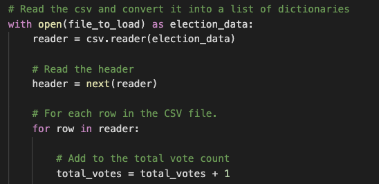
    - We utilized the *print* statement to show the final vote count.
      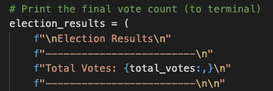
      
- Breakdown of the number of votes and the percentage of total votes for each county in the precinct:
  - **Results**:
    - Jefferson: 38,855 total number of votes, 10.5% of the total votes
    - Denver: 306,055 total number of votes, 82.8% of the total votes
    - Arapahoe: 24,801 total number of votes, 6.7% of the total votes
  - **Process**:
    - In order to link the number of votes to each county, we first declared an empty list and dictionary.
      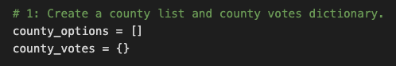
    - Inside the *for* loop, we added a decision statement to extract the county names and track the votes for that specific county.  We set each of the county's vote count to 0, then wrote the script: *county_votes[county_name] += 1* outside the *if* statement in order for the vote to be counted incrementally.
      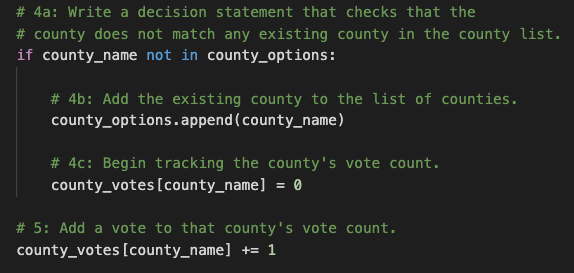 
    - We created a *for* loop to calculate the final results including a formula to show the percentage of the total votes that each county received.
      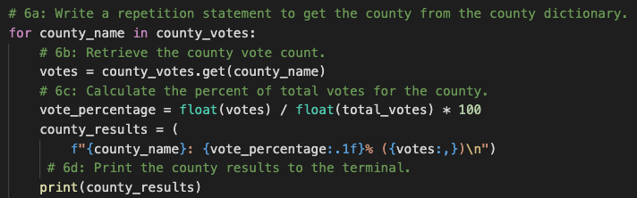
  
- County with the largest number of votes:
  - **Results**: Denver
  - **Process**:
    - We first initialized an empty string and variable to hold the name and total number of votes for the county with the largest number of votes.
      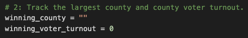
    - We then created a decision statement to determine the result.  This script was added within the repetition statement that determined the number of votes for each county.
      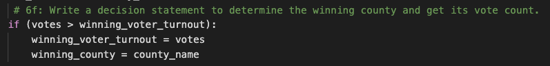
    - We created a *print* statement to show the end result.
      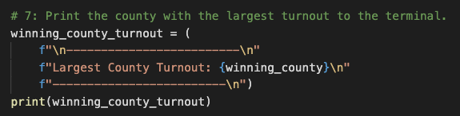
  
- Breakdown of the number of votes and the percentage of the total votes each candidate received:
  - **Results**:
    - Charles Casper Stockham: 85,213 total number of votes, 23.0% of the total votes
    - Diana DeGette: 272,892 total number of votes, 73.8% of the total votes
    - Raymon Anthony Doane: 11,606 number of votes, 3.1% of the total votes
  - **Process**: 
    - Here, we used the same logic as we did for determining the per county totals.  Instead of county, we broke this down by candidates.
      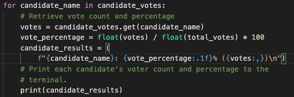
  
- Winning candidate, their vote count, and their percentage of the total votes:
  - **Results**: Diana DeGette won with a total of 272,892 votes winning 73.8% of the total votes.
  - **Process**: 
    - Again, we used the same process as we did for determining the winning county but added the percentage of the total votes to the result.
      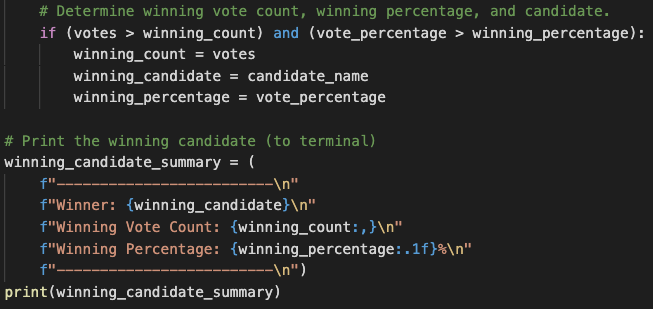

## **3. Election Audit Summary**

In this project, we were tasked with automating the election audit of a congressional precinct for the Colorado Board of Elections.  We successfully wrote a script that achieved this goal with the results showing Diana DeGette winning this precinct. 

Once we found a successful solution, the eventual goal of this project was to implement this script for uses in other election audits.  We can achieve this objective as evident in the examples listed below.

- This script can be modified for use in a state-wide senatorial election audit.  Assuming that the tabulated votes in the data source .csv file we receive will contain *Ballot ID, County, Candidate* and *Party Affiliation*, we can add the results to see if a Republican or a Democrat won the state's Senate seat.  This can be achieved by adding the following to the existing script:
  - Create a party list and party votes dictionary.
    - party_options = []
    - party_votes{}
  - Track the winning party, winning vote count and percentage.
    - winning_party = ""
    - winning_party_votes = 0
    - winning_party_percentage = 0
  - Extract the party name from each row inside the *for* loop.
    - party_name = row[3]
  - Write a decision statement that checks that the party is listed once.
    - if party_name not in party_options:
      - party_options.append(party_name)
      - party_votes[party_name] = 0
    - party_votes[party_name] += 1
  - Write a repetition statement to extract party from the party dictionary:
    - for party_name in party_votes:
      - votes = party_votes.get(party_name)
      - vote_percentage = float(votes) / float(total_votes) * 100
      - party_results = (
            f"{party_name}: {vote_percentage:.1f}% ({votes:,})\n")
      - print(party_results)
      - if (votes > winning_party_votes) and (vote_percentage > winning_party_percentage):
        - winning_party_votes = votes
        - winning_party = party_name
        - winning_party_percentage = vote_percentage
  - Print the result of the winning party
    - winning_party_summary = (
      - f"-------------------------\n"
      - f"Winning Party: {winning_party}\n"
      - f"Winning Party Vote Count: {winning_party_votes:,}\n"
      - f"Winning Percentage: {winning_party_percentage:.1f}%\n"
      - f"-------------------------\n""
    - print(winning_party_summary)

- Essentially, the script can be used in any other elections by simply modifying the list and dictionaries.  For example, if we receive data source information tabulating voting results by congressional districts instead of by county, we can simply update the script with *districts* in place of *county*.  

- Finally, for use of this script in any elections we need to simply update the load and save file path with the relevant .csv and .txt files.
  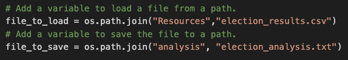